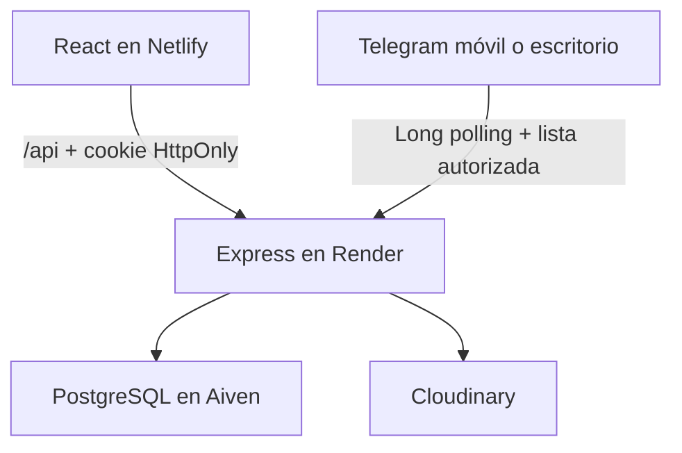

# TASA System — guía técnica

## 1. Propósito

TASA System centraliza la planificación y el seguimiento de trabajos de mantenimiento, materiales requeridos, reservas SAP, activos, históricos e incidencias de planta. El sistema fue preparado para crecer desde la información inicial de **Pisco Sur** hacia varias plantas sin mezclar sus datos operativos.

La jerarquía territorial es:

```text
Planta → Zona → Ubicación → Activo/Equipo opcional
```

Un activo puede existir temporalmente sin zona, ubicación o equipo. Las órdenes, pedidos, importaciones e históricos siempre pertenecen a una planta.

## 2. Arquitectura



- `client/`: React, navegación y vistas operativas.
- `server/`: API Express, bot, importaciones, autorización y auditoría.
- `server/prisma/`: modelo y migraciones PostgreSQL.
- `client/netlify.toml`: proxy `/api/*` hacia Render y fallback SPA.

Netlify actúa como proxy de la API. Así, el navegador recibe la cookie de sesión desde el mismo sitio visible y no necesita guardar el JWT en `localStorage`.

## 3. Autenticación y autorización

1. `POST /auth/login` compara la contraseña con bcrypt.
2. Si la contraseña existente aún está en texto plano, un inicio válido la migra a bcrypt de forma automática.
3. El backend firma un JWT de 8 horas y lo entrega únicamente como cookie `HttpOnly`, `Secure` en producción y `SameSite=Lax`.
4. Cada solicitud vuelve a consultar al usuario, su planta, rol, estado y `tokenVersion`.
5. Cambiar la contraseña, desactivar al usuario o cambiar su rol invalida sus sesiones previas.

El script idempotente `npm run passwords:migrate` permite migrar todos los usuarios después de un backup. No vuelve a hashear una contraseña que ya tenga formato bcrypt.

### Roles

| Rol | Planta propia | Otras plantas | Administración |
|---|---|---|---|
| `SUPER_ADMIN` | Lectura y escritura | Lectura y escritura | Plantas, usuarios, temporadas, exportación, importación y transferencias |
| `ADMIN_PLANTA` | Lectura y escritura | Solo lectura | Usuarios, temporadas, Telegram, importación y exportación de la planta seleccionada |
| `SUPERVISOR` | Lectura y escritura operativa | Solo lectura | Sin gestión de usuarios ni exportación total |
| `TECNICO_OPERADOR` | Operación de su planta | Sin acceso | Pedidos y registros operativos |
| `ALMACEN` | Operación de su planta | Sin acceso | Puede atender estados de solicitudes |
| `CONSULTA` | Solo lectura | Sin acceso | Ninguna mutación |
| `AUDITOR` | Lectura y auditoría de su planta | Sin acceso | Consulta del registro de auditoría |

El aislamiento no depende del frontend. Un contexto por solicitud agrega `plantaId` a las consultas Prisma y valida referencias como zona, ubicación, equipo, activo y temporada.

## 4. Modelo funcional

- `Planta`: tenant operativo.
- `Zona` y `Ubicacion`: jerarquía de planta.
- `Activo`: puede estar sin mapeo; `codigoActivo` es único dentro de la planta.
- `Equipo`: equipo técnico asociado a zona y ubicación.
- `Temporada`: `CHIV1-AA` o `CHIV2-AA`, con una sola activa por planta.
- `OTbasico`, `Ots`, `OTBot`: planificación, ejecución web y disponibilidad en Telegram.
- `Consumible`: catálogo global SAP/Maximo.
- `OTMovimientoSAP`: reserva o movimiento de material por planta y temporada.
- `SolicitudMaterial` y `SolicitudMaterialDetalle`: bandeja común para origen `WEB` o `TELEGRAM`.
- `Historico`, `ActivoHistorial` y demás históricos: conservan su planta de origen.
- `Importacion`: archivo, checksum, usuario, conteos y errores por carga.
- `Auditoria`: bitácora append-only de autenticación, mutaciones, exportaciones y operaciones sensibles.

## 5. Temporadas CHIV

El código se construye con tipo, número y año:

- CHIV 1 de 2025 → `CHIV1-25`
- CHIV 2 de 2025 → `CHIV2-25`

La migración detecta códigos históricos equivalentes en `OTbasico.Temp`, crea las temporadas y activa la más reciente. Las nuevas importaciones SAP y OT para Telegram exigen una temporada seleccionada o activa.

## 6. Importaciones

Todas las cargas aceptan solamente `.xlsx`, como máximo 12 MB, y requieren administrador.

### Activos

- Usa `server/templates/Plantilla_Importacion_Activos.xlsx`.
- `codigo_activo` y `nombre` son obligatorios.
- Zona, ubicación y equipo son opcionales.
- Si coinciden de forma inequívoca con la jerarquía de la planta se enlazan por ID; los nombres desconocidos se conservan como texto y se reportan como advertencia, sin descartar el activo.
- Un código existente se actualiza y uno nuevo se crea.
- No elimina activos ausentes.
- El checksum evita repetir una importación ya completada.

### SAP

- `MERGE` es el modo predeterminado y no elimina registros ausentes.
- `SNAPSHOT` elimina solamente filas antiguas de las OT incluidas, en la misma planta y temporada.
- Si alguna fila del archivo falla, `SNAPSHOT` no ejecuta eliminaciones.
- Se genera una clave estable para evitar duplicados.

### OT de Telegram

Actualiza o crea por combinación `plantaId + otNumero`; no borra las OT que no estén en el archivo.

## 7. Telegram

El bot usa long polling y no requiere una ruta HTTP pública. Debe existir una sola instancia del bot para evitar conflictos de polling.
Solo acepta operaciones en chats privados; la autorización se enlaza al ID de la cuenta (`from.id`), no al ID de un grupo ni al dispositivo.

- `/miid`: siempre disponible y muestra el ID de la cuenta Telegram.
- `/start PISCO_SUR`: registra una solicitud de acceso para esa planta.
- Un no autorizado solo recibe el mensaje de restricción y no puede consultar datos.
- El administrador vincula la solicitud con un usuario web desde Administración.
- El ID se busca mediante HMAC-SHA-256 y se conserva cifrado con AES-256-GCM para notificaciones salientes.
- El mismo ID sirve en celular y laptop si se usa la misma cuenta Telegram.
- Las consultas y pedidos se limitan a la planta del usuario vinculado.
- Los pedidos se guardan en `SolicitudMaterial` con origen `TELEGRAM` y aparecen en Reportes → Por: Telegram.
- Al cambiar el estado mediante la API, el bot notifica al solicitante.

`TELEGRAM_DATA_KEY` debe permanecer estable y respaldada. Cambiarla sin una migración de claves invalida la búsqueda y el descifrado de accesos existentes.

## 8. Endpoints principales añadidos

| Método y ruta | Función |
|---|---|
| `POST /auth/login` | Iniciar sesión y emitir cookie |
| `GET /auth/me` | Recuperar la sesión actual |
| `POST /auth/logout` | Cerrar sesión |
| `GET /plantas` | Plantas seleccionables según rol |
| `/admin/usuarios` | Gestión de usuarios y roles |
| `/admin/temporadas` | Gestión de CHIV |
| `/admin/telegram` | Aprobar o revocar cuentas Telegram |
| `POST /admin/activos/:id/transferir` | Transferencia auditada, solo SUPER_ADMIN |
| `/solicitudes-material` | Bandeja unificada web/Telegram |
| `/importaciones/activos` | Importar activos y descargar plantilla |
| `GET /auditoria` | Bitácora paginada |

## 9. Desarrollo local

1. Copiar `server/.env.example` y `client/.env.example` a archivos locales `.env` no versionados.
2. En `server/`: `npm ci`, `npx prisma generate`, `npm run dev`.
3. En `client/`: `npm ci`, `npm start`.
4. Para cliente local directo, usar `REACT_APP_API_URL=http://localhost:3001/` y agregar `http://localhost:3000` a `FRONTEND_URLS`.

## 10. Verificaciones incluidas

- `npm test`: temporadas, criptografía Telegram, sanitización de auditoría, lectura XLSX y bloqueo de cambios de planta por mass assignment.
- `npm run prisma:validate`: validación del modelo.
- `npm run build` en `client/`: compilación Netlify.
- `npm audit --omit=dev`: dependencias que llegan a producción.

Las migraciones deben probarse primero sobre una copia de Aiven; nunca mediante `prisma db push` sobre producción.
